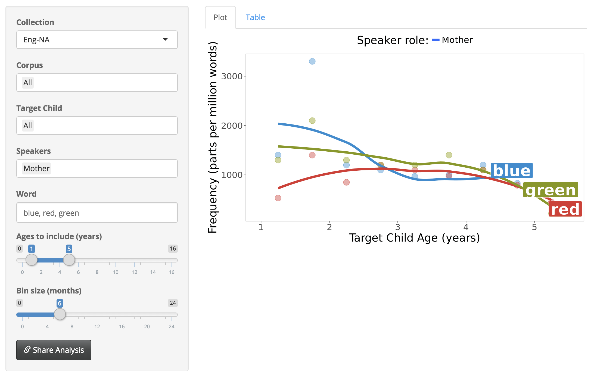

```{r load_packages, echo = FALSE, warning=FALSE}
library(papaja)
library(tidyverse)
library(childesr)
library(directlabels)
library(png)
library(here)
library(lme4)
library(ggthemes)
library(optimx)
knitr::opts_chunk$set(cache = TRUE, echo = FALSE)
```

# Introduction

What are the representations that children learn about language, and how do they emerge from the interaction of learning mechanisms and environmental input?
Developing facility with language requires learning a great many interlocking components -- meaningful distinctions between sounds (phonology), names of particular objects and actions (word learning), meaningful sub-word structure (morphology), rules for how to organize words together (syntax), and context-dependent and context-independent aspects of meaning (semantics and pragmatics).
Key to learning all of these systems is the contribution of the child's input -- exposure to linguistic and non-linguistic data -- in the early environment.
While in-lab experiments can shed light on linguistic knowledge and some of the implicated learning mechanisms, characterizing this early environment requires additional research methods and resources.

One of the key methods that has emerged to address this gap is the collection and annotation of speech to and by children, often in the context of the home.
Starting with Roger Brown's [-@brown1973] work on Adam, Eve, and Sarah, audio recordings -- and more recently video recordings -- have been augmented with rich, searchable annotations to allow researchers to address a number of questions regarding the language learning environment.
Focusing on language learning in naturalistic contexts also reveals that children have, in many cases, productive and receptive abilities exceeding those demonstrated in experimental contexts. Often, children's most revealing and sophisticated uses of language emerge in the course of naturalistic play.

While corpora of early language acquisition are extremely useful, creating them requires significant resources.
Collecting and transcribing audio and video is costly and extremely time consuming -- even orthographic transcription (i.e., transcriptions with minimal phonetic detail) can take ten times the duration of the original recording [@macwhinney2000].
Automated, machine learning-based methods like automatic speech recognition (ASR) have provided only modest gains in efficiency.
Such systems are limited both by the less-than-ideal acoustic properties of home recordings, and also by the poor fit of language models built on adult-directed, adult-produced language samples to child-directed and child-produced speech.
Thus, researchers' desires for data in analyses of child language corpora can very quickly outstrip their resources.
<!-- data pooling is necessary) -->

Established in 1984 to address this issue, the Child Language Data Exchange System (CHILDES) aims to make transcripts and recordings relevant to the study of child language acquisition available to researchers as free, public datasets [@macwhinney1985; @macwhinney2000; @macwhinney2014].
CHILDES now archives tens of thousands of transcripts and associated media across 20+ languages, making it a critical resource for characterizing both children’s early productive language use and their language environment.
As the first major effort to consolidate and share transcripts of child language, CHILDES has been a pioneer in the move to curate and disseminate large-scale behavioral datasets publicly.

Since its inception, a tremendous body of research has made use of CHILDES data.
Individual studies are too numerous to list, but classics include studies of morphological over-regularization [@marcus1992], distributional learning [@redington1998], word segmentation [@goldwater2009], the role of frequency in word learning [@goodman2008], and many others.
Some studies analyze individual examples in depth [e.g., @snyder2007], others track multiple child-caregiver dyads [e.g., @meylan2017], and still others use the aggregate properties of all child or caregiver speech pooled across corpora [e.g., @redington1998; @montagEtAl2015].
<!-- These are just a few of the thousands of studies that make use of CHILDES corpora. -->

Nonetheless, there are some outstanding challenges working with CHILDES, both for students and for advanced users.
The CHILDES ecosystem uses a specialized file format (CHAT), which is stored as plain text but includes structured annotations grouped into tiers stored on separate lines.
These tiers allow information about utterances to be stored with accompanying information such as the phonological, morphological, or syntactic structure of the utterance.
These files are usually analyzed using a command-line program (CLAN) that allows users to count word frequencies, compute statistics (e.g., mean length of utterance, or MLU), and execute complex searches against the data.
While this system is flexible and powerful, mastering the CHAT codes and especially the CLAN tool with its many functions and flags can be daunting.
These technical barriers decrease the ease of exploration by a novice researcher or in a classroom exercise.

On the opposite end of the spectrum, for data-oriented researchers who are interested in doing large-scale analyses of CHILDES, the current tools are also not ideal.
CLAN software is an excellent tool for interactive exploration, but -- as a free-standing application -- it can be tricky to build into a processing pipeline written in Python or R.
Thus, researchers who would like to ingest the entire corpus (or some large subset) into a computational analysis typically write their own parsers of the CHAT format to extract the subset of the data they would like to use [e.g., @redington1998;@yang2013;@meylan2017].

The practice of writing custom parsers is problematic for a number of reasons.
First, effort is wasted in implementing the same features again and again.
Second, this process can introduce errors and inconsistencies in data handling due to difficulties dealing with the many special cases in the CHAT standard.
Third, these parsing scripts are rarely shared -- and when when they are, they typically break with subsequent revisions to the dataset -- leading to much greater difficulty in reproducing the exact numerical results from previous published research that used CHILDES [see e.g., @meylan2017 for an example].
Fourth, the CHILDES corpus itself is a moving target: computational work using the entire corpus at one time point may include a different set of data than subsequent work due as corpora are added and revised. 
Currently, there is no simple way for researchers to document exactly which version of the corpus has been used, short of creating a full mirror of the data.
These factors together lead to a lack of *computational reproducibility*, a major problem that keeps researchers from verifying or building on published research [@donoho2010;@stodden2016].

In the current manuscript, we describe a system for extending the functionality of CHILDES to address these issues.
Our system, `childes-db`, is a database-formatted mirror of CHILDES that allows access through an application programming interface (API).
This infrastructure allows the creation of web applications for browsing and easily visualizing the data, facilitating classroom use of the dataset.
Further, the database can be accessed programmatically by advanced researchers, obviating the need to write one-off parsers of the CHAT format.
The database is versioned for access to previous releases, allowing computational reproducibility of particular analyses.

We begin by describing the architecture of `childes-db` and the web applications that we provide.
Next, we describe the `childesr` API, which provides a set of R functions for programmatic access to the data while abstracting away many of the technical details.
We conclude by presenting several worked examples of specific uses of the system -- both web apps and the R API -- for research and teaching.

# Design and technical approach

As described above, CHILDES is most often approached as a set of distinct CHAT files, which are then parsed by users, often using CLAN.
In contrast to this parsing approach, which entails the sequential processing of strings, `childes-db` treats CHILDES as a set of linked tables, with records corresponding to intuitive abstractions such as words, utterances, and transcripts [see @klineCLANtoR for an earlier example of deriving tabular representations of CHILDES].
Users of data analysis languages like R or Julia, libraries like Pandas, or those familiar with Structured Query Language (SQL) will be familiar with operations on tables such as filtering (subsetting), sorting, aggregation (grouping), and joins (merges).
These operations obviate the need for users to consider the specifics of the CHAT representation -- instead they simply request the entities they need for their research and allow the API to take care of the formatting details.
We begin by orienting readers to the design of the system via a top-level description and motivation for the design of the database schema, then provide details on the database’s current technical implementation and the versioning scheme.
Users primarily interested in accessing the database can skip these details and focus on access through the `childesr` API and the web apps.
<!-- SM: not sure if we want to have readers skip this; there may be some conceptual dependencies here -->
<!-- We first present the design and technical approach of childes-db, then describe the interactive analysis tools provided by our web-based frontend.  -->

## Database format

At its core, `childes-db` is a database consisting of a set of linked tabular data stores where records correspond to linguistic entities like words, utterances, and sampling units like transcriptions and corpora.
The smallest unit of abstraction tracked by the database is a *token*, treated here as the standard (or citation) orthographic form of a word.
Using the standardized written form of the word facilitates the computation of lexical frequency statistics for comparison or aggregation across children or time periods.
Deviations from the citation form -- which are particularly common in the course of language development and often of interest to researchers -- are kept as a separate (possibly null) field associated with each token.


```{r database-schema, fig.pos="t", out.width = "95%", fig.cap="Database schema for `childes-db`. Tokens are linked to superordinate groupings of utterances, transcripts, corpora, and collections (red arrows). All tokens and utterances are additionally associated with a participant (blue arrows)."}

png::readPNG(here::here("images/schema.png")) %>% grid::grid.raster()
```

Many of the other tables in the database are hierarchical collections built out of tokens -- *utterance*, *transcript*, *corpus*, and *collection* -- that store attributes appropriate for each level of description.
Every entity includes attributes that link it to all higher-order collections, e.g., an utterance lists the transcript, corpus, and collection to which it belongs.
An *utterance* contains one or more words and includes fields such as the utterance type such as *declarative* or *interrogative*, total number of tokens, and the total number of morphemes if the morphological structure is available in the original CHAT file.
A *transcript* consists of one or more utterances and includes the date collected, the name of the target child, and age in days if defined, and the filename from CHILDES.
A *corpus* consists of one or more transcripts, corresponding to well-known collections like the Brown [@brown1973] or Providence [@demuth2006word] corpora.
Finally, a *collection* is a superordinate collection of corpora generally corresponding to a geographic region, following the convention in CHILDES.
Because every record can be linked to a top-level collection (generally corresponding to a language), each table includes data from all languages represented in CHILDES.

Participants -- generally children and caregivers -- are represented separately from the token hierarchy because it is common for the same children to appear in multiple transcripts.
A participant identifier is associated with every word and utterance, including a name, role, 3-letter CHILDES identifier (CHI = child, MOT = mother, FAT = father, etc.), and the range of ages (or age of corresponding child) for which they are observed.
For non-child participants (caregivers and others), the record additionally contains an identifier for the corresponding target child, such that data corresponding to children and their caregivers can be easily associated.

## Technical implementation

`childes-db` is stored as a MySQL database, an industry-standard, open-source relational database server that can be accessed directly from a wide range of programming languages.
The childes-db project provides hosted, read-only databases for direct access and for `childesr` (described below) as well as compressed .sql exports for local installation.
While the former is appropriate for most users, local installation can provide performance gains by allowing a user to access the database on their machine or on their local network, as well as allowing users to store derived information in the same database.

In order to import the CHILDES corpora into the MySQL schema described above, it must first be accurately parsed and subsequently vetted to ensure its integrity.
We parse the XML (eXtensible Markup Language) release of CHILDES hosted by \url{childes.talkbank.org} using the NLTK library in Python [@bird2004].
<!-- details of our contribution to the CHILDES corpus module in NLTK---didn't we change it? AS: I don't know if I would call it a "contribution" -- we just refactored it to make it more convenient for our purposes -->
Logic implemented in Python converts the linear, multi-tier parse into a tabular format appropriate for `childes-db`.
This logic includes decisions that we review below regarding what information sources are captured in the current release of the database and which are left for future development.


The data imported into `childes-db` is subject to data integrity checks to ensure that our import of the corpora is accurate and preferable over ad-hoc parsers developed by many individual researchers.
<!-- MCF: more testing details would be useful -->
In order to evaluate our success in replicating CLAN parses, we compared unigram counts in our database with those outputted by CLAN, the command-line tool built specifically for analysis of transcripts coded in CHAT.
We used the CLAN commands FREQ and MLU to compare total token counts and mean lengths of utterance for every speaker in every transcript and compared these these values to our own using the Pearson correlation coefficient.
The results of the comparison were .99 and .98 for the unigram count and MLU data, respectively, indicating reliable parsing.

```{r, eval=FALSE, message=FALSE, warning=FALSE, include=FALSE}
# plot error between clan counts and our counts for speaker unigrams
freq_data <- read_csv("data/freq_testing.csv")

ggplot(freq_data %>%
         mutate(error = abs(clan - db) / clan),
       aes(error)) +
  geom_density() +
  xlim(0,.25)
```

```{r, eval=FALSE, include=FALSE}
# plot error between clan counts and our counts for mlu-w
mlu_data <- read_csv("data/mlu_testing.csv")

ggplot(mlu_data %>%
         mutate(error = abs(clan - db) / clan),
       aes(error)) +
  geom_density() +
  xlim(0,.25)
```

<!-- SM: what were the results of these comparisons?  -->
<!-- AS: technically this is all we do right now SM: what more can we do for low technical investment-->

### Versioning

The content of CHILDES changes as additional corpora are added or transcriptions are updated; as of time of writing, these changes are not systematically tracked.
To facilitate reproducibility of past analyses, we introduce a simple versioning system by adding a new complete parse of the current state of CHILDES every six months or as warranted by changes in CHILDES.
By default, users interact with the most recent version of the database available.
To support reproduction of results with previous versions of the database, we continue to host recent versions (up to the last three years / six versions) through our `childesr` API so that researchers can run analyses against specific historical versions of the database.
For versions more than three years old, we host compressed .sql files that users may download and serve using a local installation of MySQL server.
<!-- SM: How easy is it to implement versioning in the Shiny apps? This would show anyone using the web app the availability of the versions AS: app functionality depends on db version in some cases, so nontrivial SM: let's punt-->

### Current Annotation Coverage

The current implementation of `childes-db` emphasizes the computation of lexical statistics, and consequently focuses on reproducing the words, utterances, and speaker information in CHILDES transcripts.
For this reason, we do not preserve all of the information available in CHILDES, such as:

- Sparsely annotated tiers, e.g. phonology (`%pho`) and situation (`%sit`)
- Media links
<!--- Compound word markers, indicated with underscores ("green_eggs_and_ham") AS: we have this -->
- Tone direction and stress
- Filled pauses
- Reformulations, word revision, and phrase revision, e.g. \textless what did you\textgreater [//] how can you see it ?
- paralinguistic material, e.g. [=! cries]

We will prioritize the addition of these information sources and others in response to community feedback. <!--AS: removed this, as adding this info would require adding new columns: extending coverage to the above information sources will not require changes to the existing database schema. -->

# Interfaces for Accessing childes-db

We first discuss the `childes-db` web apps and then introduce the `childesr` `R` package.

## Interactive Web Apps

The ability to easily browse and explore the CHILDES corpora is a cornerstone of the childes-db project.
To this end we have created powerful yet easy-to-use interactive web applications that enable users to visualize various dimensions of the CHILDES corpus: frequency counts, mean lengths of utterance, type-token ratios, and more.
All of this is doable without the requirement of understanding command-line tools or any kind of programming knowledge as had been the case with CLAN.^[The LuCiD toolkit [@chang2017] provides related functionality for a number of common analyses.
In contrast to those tools, which focus on filling gaps not covered by CLAN -- e.g., the use of $n$-gram models, incremental sentence generation, and distributional word classification -- our web apps focus on covering the same common tasks as CLAN, but making the outputs into browsable visualizations.]

Our web apps are built using Shiny, an R package that enables easy app construction using `R`.
Underneath the hood, each web app is making calls to our `childesr` API and subsequently plots the data using the popular R plotting package `ggplot2`.
A user's only task is to configure exactly what should be plotted through a series of buttons, sliders, and text boxes.
The user may specify what collection, corpus, child, age range, caregiver, etc., should be included in a given analysis.
The plot is displayed and updated in real-time, and the underlying data are also available for download alongside the plot.
All of these analyses may also be reproduced using the `childesr` package, but the web apps are intended for the casual user who seeks to easily extract developmental indices quickly and without any technical overhead.
<!-- We next walk through the three web apps provided on our website and describe their functionality in more detail.  -->

### Frequency Counts

The lexical statistics of language input to children have long been an object of study in child language acquisition research.
Frequency counts of words in particular may provide insight into the cognitive, conceptual, and linguistic experience of a young child [see e.g., @ambridge2015 for review].
In this web app, inspired by ChildFreq [@baath2010], we provide users the ability to search for any word spoken by a participant in the CHILDES corpora and track the usage of that word by a child or caregiver over time.
Because of the various toggles available to the user that can subset the data, a user may word frequencies curves for a single child in the Brown corpus or all Spanish speaking children, if desired.
In addition, users can plot frequency curves belonging to caregivers alongside their child for convenient side-by-side comparisons.
A single word or multiple words may be entered into the input box.

```{r frequency-app2, fig.pos="h", out.width = "95%", fig.cap="Frequency Counts."}

png::readPNG(here::here("images/freq_app.png")) %>% grid::grid.raster()
```

### Derived Measures

The syntactic complexity and lexical diversity of children's speech are similarly critical metrics for acquisition researchers [@miller1981;@watkins1995].
There are a number of well-established measures of children's speech that operationalize complexity and diversity, and have many applications in speech-language pathology (SLP), where measures outside of the normal range may be indicative of speech, language, or communication disorders.

Several of the most common of these measures are available in the Derived Measures app, which plots these measures across age for a given subset of data, again specified by collection, corpora, children, and speakers.
As with the Frequency Counts app, caregivers' lexical diversity measures can be plotted alongside children's.

We have currently implemented the following measures:

- MLU-w (mean length of utterance in words),
- MLU-m (mean length of utterance in morphemes),
- TTR [type-token ratio, a measure of lexical diversity; @templin1957],
- MTLD [measure of textual lexical diversity; @malvernRichards1997],
- HD-D [lexical diversity via the hypergeometric distribution; @mccarthy2010]
<!-- AS: removed voc-d as HDD is idealized version of voc-d -->
<!-- MCF: need citations for voc-d HD-dand MTLD -->

\noindent As with the Frequency Counts app, a user may subset the data as they choose, compare measures between caregivers and children, and aggregate across children from different corpora.

```{r derived-measures-app2, fig.pos="h", out.width = "95%", fig.cap="Derived Measures."}

png::readPNG(here::here("images/derived_measures_app.png")) %>% grid::grid.raster()
```

### Population Viewer

Many times a researcher will want to investigate the statistics of corpora (e.g., their size, number of utterances, number of tokens) before choosing a target corpus or set of corpora for a project.
This web app is intended to provide a basic overview regarding the scale and temporal extent of various corpora in CHILDES, as well as giving researchers insight into the aggregate characteristics of CHILDES.
For example, examining the aggregate statistics reveals that coverage in CHILDES peaks at around 30 months.
<!-- SM: note that the graphs don't currently include a grouping factor, so adding multiple corpora generates one line, so you can't actually compare two corpora in the same visualization -->

```{r population-viewer-app, fig.pos="h", out.width = "95%", fig.cap="Population Viewer."}

png::readPNG(here::here("images/population_viewer_app.png")) %>% grid::grid.raster()
```

## The `childesr` Package

Although the interactive analysis tools described above cover some of the most common use cases of CHILDES data, researchers interested in more detailed and flexible analyses will want to interface directly with the data in `childes-db`.
Making use of the `R` programming language [@R-base], we provide the `childesr` package. `R` is an open-source, extensible statistical computing environment that is rapidly growing in popularity across fields and is increasing in use in child language research [e.g. @song2015; @norrman2015].
The `childesr` package abstracts away the details of connecting to and querying  the database.
Users can take advantage of the tools developed in the popular `dplyr` package [@R-dplyr], which makes manipulating large datasets quick and easy.
We describe the commands that the package provides and then give several worked examples of using the package for analyses.

The `childesr` package is easily installed via CRAN, the comprehensive R archive network.
To install, simply type: `install.packages("childesr")`. After installation, users have access to functions that can be used to retrieve tabular data from the database:

- `get_collections()` gives the names of available collections of corpora ("Eng-NA", "Spanish", etc.)
- `get_corpora()` gives the names of available corpora ("Brown", "Clark", etc.)
- `get_transcripts()` gives information on available transcripts (language, date, target child demographics)
- `get_participants()` gives information on transcript participants (name, role, demographics)
- `get_speaker_statistics()` gives summary statistics for each participant in each transcript (number of utterances, number of types, number of tokens, mean length of utterance)
- `get_utterances()` gives information on each utterance (glosses, stems, parts of speech, utterance type, number of tokens, number of morphemes, speaker information, target child information)
- `get_types()` gives information on each type within each transcript (gloss, count, speaker information, target child information)
- `get_tokens()` gives information on each token (gloss, stem, part of speech, number of morphemes, speaker information, target child information)

\noindent Each of these functions take arguments that restrict the query to a particular subset of the data (e.g. by collection, by corpus, by speaker role, by target child age, etc.) and returns the output in the form of a table.
All functions support the specification of the database version to use.
For more detailed documentation, see the package repository (http://github.com/langcog/childesr).


# Using childes-db: Worked Examples

In this section we give a number of examples of how `childes-db` can be used in both research and teaching, using both the web apps and the R API. Note that all of these examples use `dplyr` syntax [@R-dplyr]; several accessible introductions to this framework are available online [e.g., @wickham2016].

## Research applications

### Color frequency

One common use of CHILDES is to estimate the frequency with which children hear different words.
These frequency estimates are used both in the development of theory [e.g., frequent words are learned earlier; @goodman2008], and in the construction of age-appropriate experimental stimuli.
One benefit of the childes-db interface is that it allows for easy analysis of how the frequencies of words change over development.
Many of our theories in which children learn the structure of language from its statistical properties implicitly assume that these statistics are *stationary*, i.e. unchanging over development [e.g., @saffran1996].
However a number of recent analyses show that the frequencies with which infants encounter both linguistic and visual properties of their environment may change dramatically over development [@fausey2016], and these changing distributions may produce similarly dramatic changes in the ease or difficulty with which these regularities can be learned [@elman1993].

To demonstrate how one might discover such non-stationarity, we take as a case study the frequency with which children hear the color words of English (e.g. "blue", "green").
Color words tend to be learned relatively late by children, potentially in part due to the abstractness of the meanings to which they refer [see @wagner2013].
However, within the set of color words, the frequency with which these words are heard predicts a significant fraction of the variance in their order of acquisition [@yurovsky2015].
But are these frequencies stationary -- e.g. do children hear "blue" as often at 12 months as they do at 24 months?
We answer this question in two ways -- first using the web apps, and then using the `childesr` package.

#### Using web apps

To investigate whether the frequency of color words is stationary over development, a user can navigate to the Frequency app, and enter a set of color words into the `Word` selector separated by a comma: here "blue, red, green."
Because the question of interest is about the frequency of words in the input (rather than produced by children), the `Speaker` field can be set to reflect this choice.
In this example we select "Mother."
Because children learn most of their basic color words by the age of 5, the age range 1--5 years is a reasonable choice for `Ages to include`.
The results of these selections are shown in Figure \ref{fig:color-shiny}.
We can also create a hyperlink to store these set of choices so that we can share these results with others (or with ourselves in the future) by clicking on the `Share Analysis` button in the bottom left corner.

From this figure, it seems likely that children hear "blue" more frequently early in development, but the trajectories of "red" and "green" are less clear.
We also do not have a good sense of the errors of these measurements, are limited to just a few colors at a time before the plot becomes too crowded, and cannot combine frequencies across speakers.
To perform this analysis in a more compelling and complete way, a user can use the `childesr` interface.

```{r color-shiny, out.width = "500px", fig.cap = "An example of using the Frequency shiny app to explore how children's color input changes over development"}

```

#### Using childesr

We can analyze these learning trajectories using `childesr` by breaking the process into five steps: (1) define our words of interest, (2) find the frequencies with which children hear these words, (3) find the proportion of the *total words* children hear that these frequencies account for, (4) aggregate across transcripts and children to determine the error in our estimates of these proportions, and (5) plot the results.

For this analysis, we will define our words of interest as the basic color words of English (except for gray, which children hear very rarely).
We store these in the `colors` variable, and then use the `get_types` function from `childesr` to get the type frequency of each of these words in all of the corpora in CHILDES.
For demonstration, we look only at the types produced by the speakers in each corpus tagged as Mother and Father.
We also restrict ourselves to children from 1--5 years old (12--60 months), and look only at the North American English corpora.

```{r define-colors, echo = TRUE}
colors <- c("black", "white", "red", "green", "yellow", "blue", "brown",
             "orange", "pink", "purple")

color_counts <- get_types(collection = "Eng-NA", 
                          role = c("Mother", "Father"),
                          age = c(12,60), 
                          type = colors)
```


```{r graph-colors}
graph_colors <- data_frame(color = colors,
                           graph_color = if_else(color == "white",
                                                 "light gray", color))

```

To normalize correctly (i.e., to ask what proportion of the input children hear consists of these color words), we need to know how many total words these children hear from their parents in these transcripts.
To do this, we use the `get_speaker_statistics` function, which will return a total number of tokens (`num_tokens`) for each of these speakers.

```{r get-token-frequencies, echo = TRUE}
# Get the ids corresponding to all of the speakers we are interested in
parent_ids <- color_counts %>%
  distinct(collection_id, corpus_id, transcript_id, speaker_id)

# Find the total number of tokens produced by these speakers
parents <- parent_ids %>%
  left_join(get_speaker_statistics(collection = "Eng-NA")) %>%
  select(collection_id, corpus_id, transcript_id, speaker_id, num_tokens)
```

We now join these two pieces of information together -- how many times each speaker produced each color word, and how many total words they produced.
We then group the data into 6-month age bins, and compute the proportion of tokens that comprise each color for each child in each 6-month bin. <!-- KM: The back-to-back summarise() calls feel a little opaque. I think there is an implicit group_by() step? -->
For comparability with the web app analysis, these proportions are converted to parts per million words.

```{r join-colors-and-tokens, echo = TRUE}
count_estimates <- color_counts %>%
  left_join(parents) %>%
  mutate(age_months = target_child_age / 30.5,
         age_bin = as.integer(floor(age_months / 6) * 6),
         color = tolower(gloss)) %>%
  group_by(age_bin, color, target_child_id, transcript_id) %>%
  summarise(count = sum(count), num_tokens = sum(num_tokens)) %>%
  summarise(count = sum(count), num_tokens = sum(num_tokens)) %>%  
  mutate(parts = count / num_tokens * 1e6)
```

Finally, we use non-parametric bootstrapping to estimate 95% confidence intervals for our estimates of the parts per million words of each color term with the `tidyboot` package.

```{r computer-color-error, echo = TRUE}
count_estimates_with_error <- count_estimates %>%  
  tidyboot::tidyboot_mean(parts) %>%
  left_join(graph_colors) %>%
  mutate(color = factor(color, levels = colors))
```

Figure \ref{fig:color-plot} shows the results of these analyses: Input frequency varies substantially over the 1--5 year range for nearly every color word.

```{r color-plot, fig.height = 5, fig.width = 10, fig.cap ="Color frequency as a function of age. Points represent means across transcripts, error bars represent 95% confidence intervals computed by nonparametric bootstrap", cache = TRUE, message = FALSE, warning = FALSE}
ggplot(count_estimates_with_error, aes(x = age_bin, y = empirical_stat,
                            ymin = ci_lower, ymax = ci_upper,
                            color = color, label = color)) +
  geom_pointrange(position = position_dodge(.5)) +
  geom_point() +
  geom_smooth(method = "loess", se = F, span = .5) +
  facet_wrap(~ color, scales = "free_y") +
  theme_few() +
  scale_color_manual(values = graph_colors$graph_color) +
  scale_x_continuous(breaks = seq(12, 60, 12),
                     name = "Age (months)") +
  scale_y_continuous(name = "Frequency (per million words)") +
  geom_dl(method = list(dl.trans(x=x +.2), "last.qp", cex=1)) +
  theme(legend.position = "none")
```

### Gender

Gender has long been known to be an important factor for early vocabulary growth, with girls learning more words earlier than boys [@huttenlocher1991].
Parent-report data from ten languages suggest that female children have larger vocabularies on average than male children in nearly every language [@eriksson2012differences].
Comparable cross-linguistic analysis of naturalistic production data has not been conducted, however, and these differences are easy to explore using `childesr`.
By pulling data from the `transcript_by_speaker` table, a user has access to a set of derived linguistic measures that are often used to evaluate a child's grammatical development.
In this worked example, we walk through a sample analysis that explores gender differences in early lexical diversity.

First, we use the `childesr` function call `get_speaker_statistics` to pull data relating to the aforementioned derived measures for children and their transcripts.
Note that we exclusively select the children's production data, and exclude their caregivers' speech.

```{r echo=TRUE}
stats <- get_speaker_statistics(role = "Target_Child")
```

This `childesr` call retrieves data from all collections and corpora, including those languages for which there are very sparse data.
In order to make any substantial inferences from our analysis, we begin by filtering the dataset to include only languages for which there are a large number of transcripts ($>500$).
We also restrict our analysis to children under the age of four years. <!-- KM: justify age range restriction? -->

```{r echo=TRUE}
number_of_transcripts_threshold <- 500
max_age <- 4

included_languages <- stats %>%
  filter(target_child_age < max_age * 365) %>%       
  count(language) %>% 
  filter(n > number_of_transcripts_threshold) %>%
  pull(language)
```

Our `transcript_by_speaker` table contains multiple derived measures of lexical diversity -- here we use MTLD [@mccarthy2005assessment].
MTLD is derived from the average length of orthographic words that are above a pre-specified type-token ratio, making it more robust to transcript length than simple TTR.
We start by filtering to include only those children for which a sex was defined in the transcript, who speak a language in our subset of languages with a large number of transcripts, and who are in the appropriate age range.
We then compute an average MTLD score for each child at each age point by aggregating across transcripts while keeping information about the child's sex and language.
Note that one child in particular, "Leo" in the eponymous German corpus, contained transcripts that were a collection of his most complex utterances (as caregivers were instructed to record); this child was excluded from the analysis.

```{r echo=TRUE}
data <- stats %>%
  filter(!is.na(target_child_sex), target_child_name != "Leo",
         language %in% included_languages) %>%
  group_by(target_child_id, target_child_age, 
           target_child_sex, language) %>%
  summarise(measure = mean(mtld)) %>%
  ungroup() %>%
  mutate(age_years = target_child_age / 365,
         target_child_sex = factor(target_child_sex, 
                                   levels = c("male","female"))) %>%
  filter(age_years < max_age)
```

The data contained in CHILDES is populated from a diverse array of studies reflecting varying circumstances of data collection.
This point is particularly salient in our gender analysis due to potential non-independence issues that may emerge from the inclusion of many transcripts from longitudinal studies.
To account for non-indepenence, we fit a linear mixed effects model with a $gender * age$ (treated as a quadratic predictor) interaction as fixed effects, child identity as a random intercept, and $gender + age$ by language as a random slope, the maximal converging random effects structure [@barr2013random].^[All code and analyses are available at https://github.com/langcog/childes-db-paper]
<!--  mod <- lmer(measure ~ target_child_sex * poly(age_years, 2) - 1 +
                    (1 | target_child_id) +
                    (target_child_sex + age_years | language),
  data = data) -->
<!-- SM: not sure I got the random effects structure right. KM: I couldn't get the model to converge with the (target_child_sex + age_years | language) random slope-->
The plot below displays the average MTLD scores for various children at different ages, split by gender, with a line corresponding to the prediction of our fit mixed effects model.

```{r echo=FALSE}
mod <- lmer(measure ~ target_child_sex * poly(age_years, 2) - 1 +
                    (1 | target_child_id) +
                    (target_child_sex + age_years | language),
  data = data, REML = TRUE, control = lmerControl(
                           optimizer ='optimx', optCtrl=list(method='nlminb')))

mod_data <- expand.grid(age_years = seq(0, max_age, .1),
                                          target_child_sex = c("male","female"),
                                          language = included_languages) %>%
  as_data_frame()

mod_data$measure <- predict(mod, newdata = mod_data,
                            re.form = ~(target_child_sex + age_years | language))
```

```{r echo=FALSE, warning=FALSE}
ggplot(data, aes(x = age_years, y = measure,
                 fill = target_child_sex, colour = target_child_sex)) +
  geom_point(alpha = .3, size=1, stroke=0) +
  geom_line(data = mod_data,
            aes(x = age_years, y = measure, color = target_child_sex)) +
  facet_wrap(~language) +
  ggthemes::theme_few() +
  ggthemes::scale_color_ptol(name = "Sex") +
  xlim(0,max_age) +
  ylim(0,15) +
  xlab("Age (years)") +
  ylab("MTLD") +
  theme(legend.position = "bottom")
```

This plot reveals a slight gender difference in linguistic productivity in young children, replicating the moderate female advantage found by @eriksson2012differences.
The goal of this analysis was to showcase an example of using `childesr` to explore the CHILDES dataset. We also highlighted some of the potential pitfalls -- sparsity and non-independance -- that emerge in working with a diverse set of corpora, many of which were collected in longitudinal studies.

## Teaching with childes-db

### In-class demonstrations

Teachers of courses on early language acquisition often want to illustrate the striking developmental changes in children’s early language.
One method is to present static displays that show text from parent-child conversations extracted from CHILDES or data visualizations of various metrics of production and input (e.g., MLU or Frequency), but one challenge of such graphics is that they cannot be modified during a lecture and thus rely on the instructor selecting examples that will be compelling to students.
In contrast, in-class demonstrations can be a powerful way to explain complex concepts while increasing student engagement with the course materials.

Consider the following demonstration about children's first words.
Diary studies and large-scale studies using parent report show that children’s first words tend to fall into a fairly small number of categories: people, food, body parts, clothing, animals, vehicles, toys, household objects, routines, and activities or states [@clark2009first;@fenson1994variability;@tardif2008].
The key insight is that young children talk about what is going on around them: people they see every day, e.g., toys and small household objects they can manipulate or food they can control.
To illustrate this point, an instructor could:

1. introduce the research question (e.g., What are the types of words that children first produce?),
2. allow students to reflect or do a pair-and-share discussion with their neighbor,
3. show the trajectory of a single lexical item while explaining key parts of the visualization (see Panel A of Figure \ref{fig:in-class-demo-plot}),
4. elicit hypotheses from students about the kinds of words that children are likely to produce,
5. make real-time queries to the web application to add students' suggestions and talk through the updated plots (Panels B and C of Figure \ref{fig:in-class-demo-plot}), and
6. finish by entering a pre-selected set of words that communicate the important takeaway point (Panel D of Figure \ref{fig:in-class-demo-plot}) .

```{r in-class-demo-plot, fig.pos="h", out.width = "95%", fig.cap="Worked example of using the web applications for in-class teaching. Panels A-D show how an instructor could dynamically build a plot during a lecture to demonstrate a key concept in language acquisition."}

png::readPNG(here::here("images/in_class_teach_viz.png")) %>% grid::grid.raster()
```

<!-- In addition to the web applications, instructors can use childes-db to download the raw data used to generate the figures. This gives students the opportunity to further explore and analyze the data they see in the plots. Moreover, this functionality provides an example of a second way that childes-db can facilitate language acquisition courses by making data easily-accessible for tutorials and student research projects.  -->

### Tutorials and programming assignments

One goal for courses on applied natural language processing (NLP) is for students to get hands-on experience using NLP tools to analyze real-world language data.
A primary challenge for the instructor is to decide how much time should be spent teaching the requisite programming skills for accessing and formatting language data, which are typically unstructured.
One pedagogical strategy is to abstract away these details and avoid having students deal with obtaining data and formatting text.
This approach shifts students' effort away from data cleaning and towards programming analyses that encourage the exploration and testing of interesting hypotheses. In particular, the `childesr` API provides instructors with an easy-to-learn method for giving students programmatic access to child language data.

<!-- The aim is to reduce time spent getting data out of CHILDES and allow more course time for thinking about interesting questions that could be answered with NLP and child language data. <!-- SM: somewhat redundant with the above. KM: agreed. --> 
<!-- Moreover, by writing our API in the R programming language, students will gain access to a general workflow can be integrated into an analysis pipeline that includes state of the art NLP tools. <!-- SM: sorry, what tools? there's very little NLP support in R b/c it's string handling is slow. KM: Fair point. I was thinking of the tidytext package (https://www.tidytextmining.com/tidytext.html), which I've used with some success.  --> 

For example, an instructor could create a programming assignment with the specific goal of reproducing the key findings in the case studies presented above -- color words or gender.
Depending on the students' knowledge of R, the instructor could decide how much of the `childesr` starter code to provide before asking students to generate their own plots and write-ups.
The instructor could then easily compare students' code and plots to the expected output to measure learning progress. 
In addition to specific programming assignments, the instructor could use the `childes-db` and `childesr` workflow as a tool for facilitating student research projects that are designed to address new research questions.  
<!-- Moreover, the instructor could take advantage of recent advances in tools for teaching literate programming such as R Markdown [@xie2015dynamic], building in pre-written blocks of executable code that demonstrate key programming concepts for students and including incomplete or blank code blocks that students can use to write their own code. <!-- SM: cool, but scope creep? KM: yeah, probably be out of scope. --> 

# Conclusion

We have presented `childes-db`, a database formatted mirror of the CHILDES dataset.
This database -- together with the `R` API and web apps -- facilitates the use of child language data.
For teachers, students, and casual explorers, the web apps allow browsing and demonstration.
For researchers interested in scripting more complex analyses, the API allows them to abstract away from the details of the CHAT format and easily create reproducible analyses of the data.
We hope that these functionalities broaden the set of users who can easily interact with CHILDES data, leading to future insights into the process of language acquisition.

childes-db addresses a number of needs that have emerged in our own research and teaching, but there are still a number of limitations that point the way to future improvements.
For example, `childes-db` currently operates only on transcript data, without links to the underlying media files; in the future, adding such links may facilitate further computational and manual analyses of phonology, prosody, social interaction, and other phenomena by providing easy access to the video and audio data.
Further, we have focused on including the most common and widely-used tiers of CHAT annotation into the database first, but our plan is eventually to include the full range of tiers.
Finally, a wide range of further interactive analyses could easily be added to the current suite of web apps.
We invite other researchers to join us in both suggesting and contributing new functionality as our system grows and adapts to researchers' needs.

# References
```{r create_r-references, warning = FALSE}
r_refs(file = "childesdb.bib")
```

\setlength{\parindent}{-0.5in}
\setlength{\leftskip}{0.5in}
